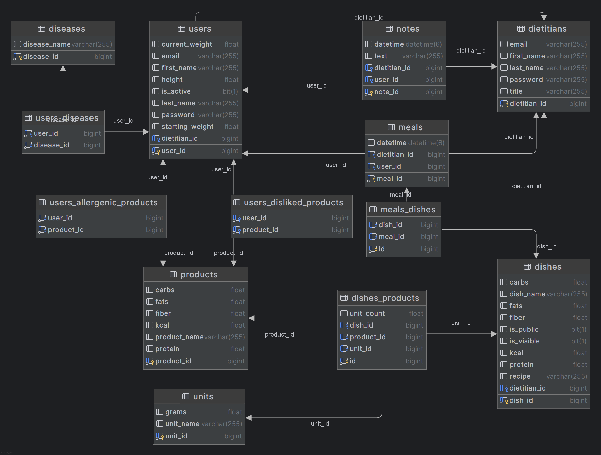

# Dietitian+ backend

The [Dietician+](https://github.com/JakubJagodzinski/dietician-plus) project backend is built using the Java Spring Boot framework. It features a well-structured database and a fully functional RESTful API, enabling seamless CRUD operations for each entity. This backend serves as the foundation for efficient data management and smooth integration with the frontend.

#### [Postman collection for api testing](https://github.com/JakubJagodzinski/dietitian-plus-backend/blob/master/Dietitian%2B.postman_collection.json)

## Database schema

