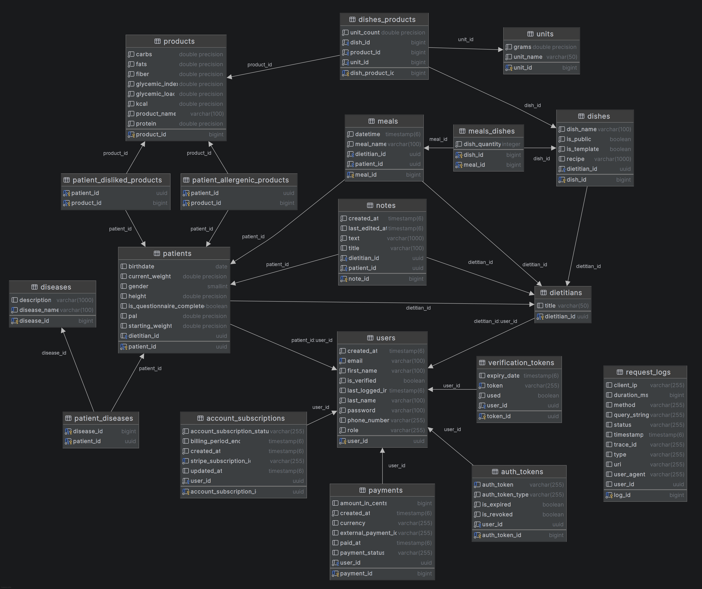

# Dietitian+ (Backend)
A comprehensive website application designed for people looking to lose weight and professional dietitians.<br>
It allows dietitians to create meal plans, generate shopping lists, and manage client progress, while users can access personalized diets and track their BMI.<br>
The backend also includes a subscription model with a paywall, Stripe payment gateway integration, account activation via email, and automated email notifications related to subscription status.<br>
<br>
The application is hosted on AWS, and the Swagger API documentation is available [here](http://51.21.186.125:8090/swagger-ui/index.html).<br>

### Make sure to visit my friend's [Dietitian+ (Frontend)](https://github.com/BartlomiejJaruga/dietitian-plus-frontend) repo

---

## Table of Contents
1. [Application Functionalities](#application-functionalities)
    - [Patient Website Features](#patient-website-features)
    - [Dietitian Website Features](#dietitian-website-features)
2. [Tech Stack](#tech-stack)
3. [Database Scheme](#database-scheme)
4. [How to Run the Project](#how-to-run-the-project)
5. [License](#license)
6. [Author](#author)

---

# Application Functionalities:
## Patient Website Features:
1. Diet Overview – Access and review meal plans assigned by the dietitian for a specific week.
2. Shopping List – Automatically generated shopping lists based on the assigned meal plan, categorized by product type and available packaging sizes (e.g., 1L, 1kg, 300g can).
3. Personal Profile & Tracking – Store personal details such as height, current weight, and calculate BMI based on daily diet progression.
4. Allergy & Intolerance Tracking – Select allergies and intolerances to ensure the dietitian only includes safe products and meals in your diet plan.
5. Meal Details – View meal compositions with specific quantities (grams/pieces/kcal) and instructions on how to prepare them.

## Dietitian Website Features:
1. Meal Plan Creation – Design weekly meal plans based on the patient's caloric needs.
2. Ingredient Management – Select ingredients with precise measurements (grams/pieces/kcal) and choose by their availability in stores (packaging sizes).
3. Template System – Ability to predefine meal templates for different days of the week, allowing easy customization.
4. Patient Interview - conduct a structured interview with the patient, collecting essential information such as personal details, medical history, allergies and intolerances.
5. Patient Management – Store and monitor patient data, including weight, height, and BMI calculations over time.
6. Easy Note's System - Create notes about every patient to store various additional data about them.
7. Diet Customization – Adjust meal plans according to individual patient preferences and progress.
8. Public Dish Library - Share created dishes to other dietitians so they can use it as a template for their meals.
9. Extensive Product Library - Take advantage of extensive product database containing all specialized data needed to compose perfect menu for patient.

---

## Tech Stack

- **Backend Framework:** Java SpringBoot
- **Database:** PostgreSQL
- **Authentication:** JWT (JSON Web Tokens), email-based account activation  
- **Payments:** Stripe API (subscription model with paywall)  
- **Email Services:** SMTP (account activation, subscription notifications)  
- **API Documentation:** Swagger / OpenAPI  
- **Hosting:** AWS (EC2 instance)  
- **Environment Management:** `venv`, `.env` with `python-dotenv`  
- **Containerization** DockerDesktop

---

# Database scheme:


---

# How to Run the Project:
### Prerequisites

- Java 21+
- Docker

### Step-by-step

1. **Clone the repository:**

```powershell
git clone https://github.com/JakubJagodzinski/dietitian-plus-backend.git
cd dietitian-plus-backend
```

2. **Prepare .env file from template**
   <br><br>

3. **Load environment variables from the `.env` file**

```powershell
Get-Content .env | ForEach-Object {
    if ($_ -match '^\s*([^#][\w\.\-]+)\s*=\s*(.*)$') {
        $name = $matches[1]
        $value = $matches[2].Trim('"')
        [System.Environment]::SetEnvironmentVariable($name, $value, 'Process')
    }
}
```
3. **Create containers**

```powershell
docker-compose up -d
```

4. **Build the project:**

```powershell
./mvnw clean package
```

5. **Run the application:**

```powershell
./mvnw spring-boot:run
```

---

## License

This project is licensed under the MIT License.

---

## Author

Jakub Jagodziński
